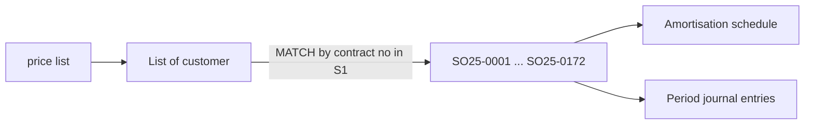
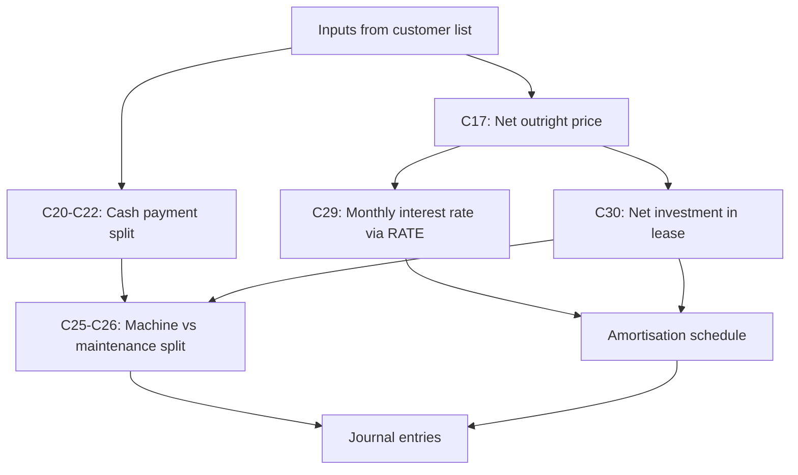

# Rent-to-Own Finance Overview

**Status:** Understanding document (Excel model analysed; Zoho implementation not started)  
**Source of truth:** [`GRSB-Rent To Own-ZOHO 1.xlsx`](GRSB-Rent%20To%20Own-ZOHO%201.xlsx)  
**Primary example:** Sheet `SO25-0001` — HAKATA F&B SDN BHD, Rent-to-own Dishwasher

> GRSB sells commercial equipment (dishwashers, ice machines) on **rent-to-own** contracts. Each monthly payment is a blended fee covering machine financing and maintenance. This workbook calculates how to split those payments for correct **finance lease revenue recognition** under lessor accounting.

---

## 1. One-sentence summary

When equipment is delivered and installed, GRSB recognises a **lease receivable** at the net selling price, splits revenue between **machine sale** and **deferred maintenance**, and each month allocates the customer's payment into **principal repayment**, **interest income**, and **maintenance revenue**.

---

## 2. Business context

### What GRSB is doing

GRSB acts as **lessor** on rent-to-own contracts. The customer pays a fixed monthly fee for a fixed term (e.g. 36 months × RM399). At the end of the term, ownership transfers to the customer.

This is **not** simple rental income. Under MFRS 16 / IFRS 16 lessor accounting, the arrangement is treated as a **finance lease** because:

- The contract transfers substantially all risks and rewards of ownership to the lessee.
- GRSB is effectively **selling the machine on credit** and earning **interest** on the outstanding balance.
- The maintenance component is a **separate service** that must be recognised over time, not upfront.

### Accounting trigger

From the `To request` sheet:

> *Agreement shall commence on the date the equipment is delivered — risk and right passes to customer upon deliver & install.*

Recognition happens at **stock-out / installation**, not at quote or order stage. At that point:

1. Inventory is removed (cost of sales).
2. A lease receivable is created at the net selling price.
3. Revenue is split between machine and deferred maintenance.
4. A 36-month (or 24-month) amortisation schedule begins.

### What each monthly payment contains

| Component | What it represents | How it is recognised |
|-----------|-------------------|----------------------|
| Machine financing | Repayment of principal + interest on lease receivable | Interest monthly; machine revenue at commencement |
| Maintenance | Prepaid service over the contract term | Deferred at commencement; recognised straight-line monthly |

The customer sees one invoice for RM399. The spreadsheet splits it into three accounting buckets.

---

## 3. Workbook architecture

### Sheet overview

| Sheet | Role |
|-------|------|
| `price list` | Master pricing — outright, lease, R-t-O fixed/quoted rates by equipment model |
| `List of customer` | Contract master data (5 active contracts, 20 rows total) |
| `SO25-0001` … `SO25-0172` | Per-contract calculation, amortisation schedule, and journal entries |
| `To request` | Business requirements notes for the Zoho system build |

### Data flow



### How contract sheets work

Each contract tab (`SO25-0001`, `SO25-0006`, etc.) is a **clone of the same template**. Cell `S1` holds the contract number (e.g. `SO25-0001`). All inputs are pulled from `List of customer` via:

```excel
=IFERROR(INDEX('List of customer'!D:D, MATCH($S$1, 'List of customer'!$B:$B, 0)), "")
```

The contract sheet then performs all calculations and outputs journal entries. A hyperlink in the customer list (`Go to contract`) jumps to the matching tab.

### Fiscal year controls

Each contract sheet has two date anchors used to filter period activity:

| Cell | Value (SO25-0001) | Meaning |
|------|-------------------|---------|
| `L2` | 2025-01-01 | Year beginning |
| `L1` | 2025-12-31 | Year end |

Journal entries for "during the period" use `SUMIFS` / `COUNTIFS` on the amortisation schedule dates (column B) to include only periods falling within the reporting year.

---

## 4. Inputs and data sources

### Contract-level inputs (SO25-0001)

All values below are pulled from `List of customer` unless noted.

| Field | Cell | Source column | SO25-0001 example |
|-------|------|---------------|-------------------|
| Customer name | A1 | D (Customer) | HAKATA F&B SDN BHD |
| Product nature | C3 | C (Nature) | Rent-to-own Dishwasher |
| Machine cost (inventory) | C4, C32 | N (Cost) | 10,000.00 |
| Lease term (months) | C5 | G (Contract period) — `LEFT(..., 2)` | 36 |
| Contract start | C6 | E (Contract start) | 2025-03-01 |
| Contract end | C7 | F (Contract end) | 2028-02-28 |
| Monthly lease payment | C8 | J (Monthly rental) | 399.00 |
| Cash selling price | C9 | `= C17` (derived) | 11,449.81 |
| Use selling price? | C11 | `IF(C9=0, "No", "Yes")` | Yes |
| Outright price | C14 | P (Outright Price) | 20,068.81 |
| Maintenance rate (per year) | C15 | Q (Maintenance Rate) | 2,873.00 |
| Maintenance years | C16 | S (Maintenance covered) — `LEFT(..., 1)` | 3 |

### How `List of customer` derives key fields

#### Outright Price (column P)

Looks up the one-off list price from `price list` based on product type, then adjusts for maintenance:

```
Outright Price = Price list outright value
               + IF Rent-to-own: (Maintenance Rate × (Maintenance years − 1)) × Rent at quoted price?
```

- **Ice machine:** looks up column J in `price list` rows 6–10, matched by Product Type.
- **Dishwasher:** looks up column J in `price list` rows 17–20, matched by Product Type.

The maintenance adjustment adds back maintenance years beyond year 1 (since the outright price on the price list is net of year-1 maintenance).

#### Maintenance Rate (column Q)

| Product type | Formula |
|-------------|---------|
| Ice machine | Fixed RM2,288/year |
| Dishwasher | `((Contract term in months / 12 × 6) − 1) × 507 / (Contract term in years)` |

For SO25-0001 (36 months): `((36/12 × 6) − 1) × 507 / 3 = (18 − 1) × 507 / 3 = 2,873/year`

#### Rent at quoted price? (column O)

Compares the customer's actual monthly rental against the price list R-t-O rate:

```
= Monthly rental / Price list R-t-O rate for that model
```

- If the customer pays the standard rate → result is `1`.
- If the customer has a negotiated rate → result is a ratio (e.g. `0.95` for a 5% discount).

This ratio scales the outright price calculation when the customer is not on the standard rate.

---

## 5. Core finance calculations

Using SO25-0001 numbers throughout.

### Stage A — Net cash selling price (machine value)

The outright price on the price list includes maintenance bundled in. To isolate the machine selling price:

```
Net outright price (C17) = Outright price − (Maintenance rate × Maintenance years)
                         = 20,068.81 − (2,873 × 3)
                         = 11,449.81
```

| Cell | Formula | Result |
|------|---------|--------|
| C14 | From customer list | 20,068.81 |
| C15 | From customer list | 2,873.00 |
| C16 | From customer list | 3 |
| **C17** | `= C14 − C15 × C16` | **11,449.81** |

This becomes the **present value (PV) anchor** — the implicit selling price of the machine component. Cell C9 points to C17, and C11 auto-sets to "Yes" when C9 is non-zero.

### Stage B — Payment decomposition (cash basis)

Before discounting, the spreadsheet splits total cash collected over the contract:

```
Total lease payment (C20)  = Lease term × Monthly payment
                         = 36 × 399
                         = 14,364.00

Total maintenance fee (C21) = Maintenance rate × Maintenance years
                            = 2,873 × 3
                            = 8,619.00

Total payable for machine (C22) = C20 − C21
                                = 14,364 − 8,619
                                = 5,745.00
```

| Cell | Formula | Result |
|------|---------|--------|
| C20 | `= C5 × C8` | 14,364.00 |
| C21 | `= C15 × C16` | 8,619.00 |
| C22 | `= C20 − C21` | 5,745.00 |

Maintenance is treated as a **fixed total** over the contract. The remainder of cash collected is attributed to the machine. Note the comment on D21: *"Maintenance price is fixed across the timeline."*

### Stage C — Implicit monthly interest rate

The spreadsheet calculates the rate that equates the PV of lease payments to the net selling price:

```
Monthly discount rate (C29) = RATE(nper=36, pmt=−399, pv=11449.81, fv=0)
                          ≈ 1.2810% per month
                          ≈ 15.37% per year (effective)
```

| Cell | Formula | Result |
|------|---------|--------|
| **C29** | `= IF(UPPER(C11)="YES", RATE(C5, −C8, C9, 0, 0), C10)` | **0.012810** |

**What RATE() solves:** find the monthly rate `r` where:

```
PV = PMT × (1 − (1 + r)^−n) / r
11,449.81 = 399 × (1 − (1.01281)^−36) / 0.01281
```

This is the **effective interest rate** on the finance lease receivable.

**Alternative path:** if `Use selling price = No` (C11), a manual rate is entered in C10 and `PV()` is used instead of the selling price:

```
C30 = IF(UPPER(C11)="YES", C9, PV(C29, C5, −C8, 0, 0))
```

### Stage D — Net investment in lease and principal split

```
Net investment in lease (C30) = Cash selling price = 11,449.81   (when C11 = Yes)

Lease portion (C25)       = (Machine cash share / Total cash) × Net investment
                        = (5,745 / 14,364) × 11,449.81
                        = 4,579.45

Maintenance portion (C26) = (Maintenance cash share / Total cash) × Net investment
                        = (8,619 / 14,364) × 11,449.81
                        = 6,870.37
```

| Cell | Formula | Result |
|------|---------|--------|
| C30 | `= IF(UPPER(C11)="YES", C9, PV(C29, C5, −C8, 0, 0))` | 11,449.81 |
| **C25** | `= C22 / C20 × C30` | **4,579.45** |
| **C26** | `= C21 / C20 × C30` | **6,870.37** |

Check: C25 + C26 = 11,449.81 = C30.

The net investment is allocated between machine revenue and deferred maintenance revenue **in proportion to their share of total cash payments**.

### Stage E — Profit at commencement

```
Revenue at commencement (C31) = Net investment in lease     = 11,449.81
Cost of sales (C32)           = Machine cost (inventory)     = 10,000.00
Selling profit (C33)          = C31 − C32                    =  1,449.81
```

| Cell | Formula | Result |
|------|---------|--------|
| C31 | `= C30` | 11,449.81 |
| C32 | Machine cost from customer list | 10,000.00 |
| **C33** | `= C31 − C32` | **1,449.81** |

This RM1,449.81 is the gross margin on the machine — the spread between what GRSB effectively "sells" the machine for (net selling price) and what it cost in inventory.

### Calculation flow diagram



---

## 6. Amortisation schedule

Rows 37–74 build a period-by-period schedule for the lease receivable.

### Column definitions

| Col | Header | Formula (period n) | Meaning |
|-----|--------|-------------------|---------|
| A | Period | 1, 2, 3 … 36 | Payment number |
| B | Date | Period 1: contract start; thereafter: `EDATE(prev, 1)` | Payment due date |
| C | Opening balance | Period 1: `C30`; thereafter: prior closing if > 0 | Outstanding lease receivable |
| D | Finance income | `Opening × C29` | Interest portion of payment |
| E | Cash received | `IF(opening ≤ 1, 0, C8)` | Total collected from customer |
| F | Principal reduction | `Cash − Interest` | Amount that reduces receivable |
| G | Closing balance | `Opening − Principal` | Remaining receivable |

### Period 1 worked example (SO25-0001)

Contract start: 2025-03-01. Monthly rate: 1.2810%.

| | Amount |
|---|--------|
| Opening balance | 11,449.81 |
| Finance income (interest) | 146.67 |
| Cash received | 399.00 |
| Principal reduction | 252.33 |
| Closing balance | 11,197.48 |

Formula check:
- Interest: 11,449.81 × 0.012810 = 146.67
- Principal: 399.00 − 146.67 = 252.33
- Closing: 11,449.81 − 252.33 = 11,197.48

### Schedule behaviour over time

- **Interest decreases** each period as the opening balance falls.
- **Principal increases** each period (more of each RM399 goes to repayment).
- **Closing balance reaches ~0** at period 36 (rounding residual: −7.46 × 10⁻¹¹).

### Totals (row 75)

| | Amount |
|---|--------|
| Total finance income (interest) | 2,914.19 |
| Total principal reduction | 11,449.81 |
| Total cash received | 14,364.00 |

Check: 2,914.19 + 11,449.81 = 14,364.00 = 36 × 399.

---

## 7. Accounting journal entries

The right side of the contract sheet (columns E–J) produces the double entries. Amounts in column I; column J has descriptions.

### Phase 1 — At commencement (delivery / installation)

Recorded once when equipment is installed and the lease begins.

| Dr / Cr | Account | Amount (RM) | Source |
|---------|---------|-------------|--------|
| Dr | Lease receivables | 11,449.81 | C30 — net investment in lease |
| Cr | Revenue — finance lease selling price | 4,579.45 | C25 — machine portion of principal |
| Cr | Deferred revenue — maintenance | 6,870.37 | C26 — maintenance portion of principal |
| Dr | Cost of Sales | 10,000.00 | C32 — inventory cost |
| Cr | Inventory | 10,000.00 | C32 — inventory cost |

**What this means:**
- GRSB records a receivable for the full net selling price.
- Machine revenue (RM4,579.45) is recognised immediately — this is the "sale" portion.
- Maintenance revenue (RM6,870.37) is deferred — earned over 36 months.
- Inventory is written off at cost.

### Phase 2 — During the reporting period

Recorded each fiscal year by aggregating amortisation schedule rows within the year.

**FY2025 example (SO25-0001):** contract starts 2025-03-01, so 10 periods fall in FY2025 (Mar–Dec).

| Dr / Cr | Account | Amount (RM) | How calculated |
|---------|---------|-------------|----------------|
| Dr | Bank | 3,990.00 | 10 periods × RM399 |
| Cr | Lease receivables | 2,673.82 | Sum of principal (col F) where date in FY |
| Cr | Revenue — finance interest income | 1,316.18 | Sum of interest (col D) where date in FY |
| Dr | Deferred revenue — maintenance | 1,908.44 | Straight-line: C26 / term × periods in FY |
| Cr | Revenue — maintenance | 1,908.44 | Matching credit |

Check: 2,673.82 + 1,316.18 = 3,990.00 (total cash collected in FY).

Maintenance recognition formula (cell I12):

```excel
= −I6 / C5 × COUNTIFS(B39:B74, "<="&L1, E39:E74, ">0", B39:B74, ">="&L2)
```

Which simplifies to: `6,870.37 / 36 × 10 = 1,908.44` — straight-line over the contract term, counted only for periods with cash received in the fiscal year.

### Journal entry flow

```mermaid
flowchart TD
    delivery["Equipment delivered & installed"] --> commence["Phase 1: Commencement journals"]
    commence --> drLease["Dr Lease receivables 11,449.81"]
    commence --> crMachine["Cr Machine revenue 4,579.45"]
    commence --> crDeferred["Cr Deferred maintenance 6,870.37"]
    commence --> cos["Dr COS 10,000 / Cr Inventory 10,000"]

    monthly["Each month: customer pays RM399"] --> split["Split payment"]
    split --> principal["Principal → reduces lease receivable"]
    split --> interest["Interest → finance interest income"]
    split --> maint["Maintenance portion → deferred revenue release"]

    fiscalYear["End of fiscal year"] --> period["Phase 2: Aggregate period journals"]
    period --> drBank["Dr Bank (total cash)"]
    period --> crReceivable["Cr Lease receivables (total principal)"]
    period --> crInterest["Cr Interest income (total interest)"]
    period --> drDefMaint["Dr Deferred maintenance"]
    period --> crMaintRev["Cr Maintenance revenue"]
```



### Full contract lifetime summary (SO25-0001)

| Revenue type | Total over 36 months | When recognised |
|-------------|---------------------|-----------------|
| Machine selling price | 4,579.45 | At commencement |
| Finance interest income | 2,914.19 | Monthly over 36 months |
| Maintenance revenue | 6,870.37 | Straight-line over 36 months |
| **Total revenue** | **14,364.00** | = 36 × RM399 |

| | Amount |
|---|--------|
| Total cash collected | 14,364.00 |
| Cost of sales (machine) | 10,000.00 |
| **Gross profit** | **4,364.00** |

Gross profit = selling profit at commencement (1,449.81) + total interest income (2,914.19) = 4,364.00.

---

## 8. Finance concepts in plain language

### Why not book RM399 as revenue each month?

The customer pays one blended fee, but it covers two distinct things:

1. **Financing a machine purchase** — GRSB is effectively lending the customer RM11,449.81 to buy the machine. Each payment repays part of that loan plus interest.
2. **Maintenance service** — GRSB provides ongoing maintenance. The customer prepays for this over 36 months, but GRSB earns it as service is delivered.

MFRS 15 / IFRS 15 requires separating these components and recognising each on the correct basis.

### Why a lease receivable?

From GRSB's perspective, the customer owes the net selling price (RM11,449.81). Monthly payments are loan repayments:

- Part reduces the outstanding balance (principal).
- Part is interest income (the cost of providing credit).

This is the same logic as a hire-purchase or car loan — just applied to commercial kitchen equipment.

### Why deferred maintenance revenue?

The customer pays for 3 years of maintenance upfront (embedded in the monthly fee). GRSB cannot recognise all RM8,619 as revenue on day one because the service has not been delivered yet.

Instead:
- RM6,870.37 is deferred at commencement (the PV-weighted maintenance portion).
- Each month, `6,870.37 / 36 = RM190.84` is released to maintenance revenue.

### Why calculate an implicit interest rate?

Without knowing the rate, you cannot split each RM399 payment between principal and interest. The `RATE()` function finds the rate that makes the math work:

- Total principal repaid over 36 months = RM11,449.81 (the net selling price).
- Total interest earned = RM2,914.19.
- Total = RM14,364.00 (36 × RM399).

Different contracts have different rates depending on the relationship between the selling price, monthly payment, and term.

### Selling profit at commencement

| | Amount |
|---|--------|
| Net selling price | 11,449.81 |
| Inventory cost | 10,000.00 |
| **Gross margin on machine** | **1,449.81** |

This margin is embedded in the machine revenue portion (C25 = 4,579.45). It is **not** the total profit on the contract — GRSB also earns RM2,914.19 in interest over the lease term.

### How this differs from simple rental

| | Simple rental | Rent-to-own (this model) |
|---|--------------|--------------------------|
| Ownership | GRSB retains | Transfers to customer at end |
| Revenue pattern | Flat monthly rental income | Machine sale + interest + maintenance |
| Balance sheet | Asset remains on books | Lease receivable created, inventory removed |
| MFRS treatment | Operating lease | Finance lease (lessor) |

---

## 9. Contract variations

The same template handles different products, terms, and payment amounts.

| Contract | Customer | Product | Term | Payment | Net price | Monthly rate | Machine portion | Maint portion |
|----------|----------|---------|------|---------|-----------|-------------|-----------------|---------------|
| SO25-0001 | HAKATA F&B | Dishwasher D1M | 36 | 399 | 11,449.81 | 1.28% | 4,579.45 | 6,870.37 |
| SO25-0006 | KAM KITCHENS | Dishwasher D1M | 36 | 699 | 14,015.00 | 3.58% | 9,214.68 | 4,800.32 |
| SO25-0135 | Craven F&B | Ice machine | 24 | 850 | 13,279.23 | 3.76% | 10,300.52 | 2,978.71 |
| SO25-0138 | Nyonya Recipe | Ice machine | 24 | 639 | 10,711.00 | 3.10% | 7,515.02 | 3,195.98 |
| SO25-0172 | Goldhill Reserve | Dishwasher D1M | 36 | 699 | 14,015.00 | 3.58% | 9,214.68 | 4,800.32 |

Observations:
- **Higher monthly payment relative to net price → higher interest rate.** SO25-0001 at RM399 has a 1.28% rate; SO25-0006 at RM699 has 3.58%.
- **Ice machines** have a fixed maintenance rate (RM2,288/year) vs dishwasher formula.
- **Shorter terms** (24 months) produce different splits even at similar payment amounts.
- SO25-0006 and SO25-0172 are identical in calculation inputs (same model, term, payment) — only customer differs.

---

## 10. Price list role

The `price list` sheet is the master pricing table that feeds into `List of customer`.

### Ice machine models (rows 6–10)

| Model | Type | 24-month R-t-O (fixed) | 24-month R-t-O (quote) | Outright |
|-------|------|------------------------|------------------------|----------|
| GR-CI100 | Cube Ice | — | — | 5,899 |
| GR-CI150 | Cube Ice | 369 | 399 | 6,599 |
| GR-CI500 | Cube Ice | 639 | 639 | 10,999 |
| GR-CI700 | Cube Ice | 799 | 999 | 12,999 |
| GR-NI1050 | Nugget Ice | 1,199 | 1,299 | 21,999 |

### Dishwasher models (rows 17–20)

| Model | Type | 36-month R-t-O (fixed) | 36-month R-t-O (quote) | 36-month (w/o detergent) | Outright |
|-------|------|------------------------|------------------------|--------------------------|----------|
| U1M | Under Counter | 399 | 300 | — | 12,888 |
| D1M | Door Lift | 699 | 450 | — | 16,888 |
| DPCR1 | One Tank Conveyor | 1,699 | 1,299 | — | 48,888 |
| DPCR2 | Two Tank Conveyor | 2,999 | 1,999 | — | 68,888 |

### How price list connects to contracts

1. Staff selects product type on the customer record.
2. `List of customer` looks up the outright price and R-t-O rate from `price list`.
3. If the customer's actual rental differs from the fixed rate, the "Rent at quoted price?" ratio adjusts the outright price.
4. The contract sheet then performs all finance calculations from these derived values.

For Zoho implementation: maintaining this price list in the system (per the `To request` sheet) is a prerequisite for auto-calculating lease terms.

---

## 11. Formula reference appendix

Grouped by section for future Deluge porting. All formulas are from sheet `SO25-0001`.

### Inputs (pulled from customer list)

| Cell | Formula |
|------|---------|
| A1 | `=IFERROR(INDEX('List of customer'!D:D, MATCH($S$1, 'List of customer'!$B:$B, 0)), "")` |
| C3 | `=IFERROR(INDEX('List of customer'!C:C, MATCH($S$1, 'List of customer'!$B:$B, 0)), "")` |
| C4 | `=IFERROR(INDEX('List of customer'!N:N, MATCH($S$1, 'List of customer'!$B:$B, 0)), "")` |
| C5 | `=LEFT(IFERROR(INDEX('List of customer'!G:G, MATCH($S$1, 'List of customer'!$B:$B, 0)), ""), 2)` |
| C6 | `=IFERROR(INDEX('List of customer'!E:E, MATCH($S$1, 'List of customer'!$B:$B, 0)), "")` |
| C7 | `=IFERROR(INDEX('List of customer'!F:F, MATCH($S$1, 'List of customer'!$B:$B, 0)), "")` |
| C8 | `=IFERROR(INDEX('List of customer'!J:J, MATCH($S$1, 'List of customer'!$B:$B, 0)), "")` |
| C9 | `=C17` |
| C11 | `=IF(C9=0, "No", "Yes")` |
| C14 | `=IFERROR(INDEX('List of customer'!P:P, MATCH($S$1, 'List of customer'!$B:$B, 0)), "")` |
| C15 | `=IFERROR(INDEX('List of customer'!Q:Q, MATCH($S$1, 'List of customer'!$B:$B, 0)), "")` |
| C16 | `=LEFT(IFERROR(INDEX('List of customer'!S:S, MATCH($S$1, 'List of customer'!$B:$B, 0)), ""), 1)` |

### Core calculations

| Cell | Formula | Notes |
|------|---------|-------|
| C17 | `=C14 − C15 × C16` | Net outright price |
| C20 | `=C5 × C8` | Total lease payment |
| C21 | `=C15 × C16` | Total maintenance fee |
| C22 | `=C20 − C21` | Machine cash portion |
| C25 | `=C22 / C20 × C30` | Machine PV portion |
| C26 | `=C21 / C20 × C30` | Maintenance PV portion |
| C29 | `=IF(UPPER(C11)="YES", RATE(C5, −C8, C9, 0, 0), C10)` | **No native Deluge equivalent** |
| C30 | `=IF(UPPER(C11)="YES", C9, PV(C29, C5, −C8, 0, 0))` | **PV() needs custom impl.** |
| C31 | `=C30` | Revenue at commencement |
| C32 | `=IFERROR(INDEX('List of customer'!N:N, MATCH($S$1, 'List of customer'!$B:$B, 0)), "")` | Cost of sales |
| C33 | `=C31 − C32` | Selling profit |

### Amortisation schedule (per period n, starting row 39)

| Cell | Formula |
|------|---------|
| B (date) | Period 1: `=$C$6`; thereafter: `=EDATE(B_prev, 1)` |
| C (opening) | Period 1: `=C30`; thereafter: `=IF(G_prev<=0, 0, G_prev)` |
| D (interest) | `=C × $C$29` |
| E (cash) | `=IF(C<=1, 0, $C$8)` |
| F (principal) | `=E − D` |
| G (closing) | `=C − F` |

### Journal entries

| Cell | Formula | Description |
|------|---------|-------------|
| I4 | `=$C$39` | Dr Lease receivables (commencement) |
| I5 | `=−C25` | Cr Machine revenue |
| I6 | `=−C26` | Cr Deferred maintenance |
| I8 | `=C32` | Dr Cost of sales |
| I9 | `=−I8` | Cr Inventory |
| I12 | `=−I6 / C5 × COUNTIFS(B39:B74, "<="&L1, E39:E74, ">0", B39:B74, ">="&L2)` | Dr Deferred maintenance (period) |
| I13 | `=−I12` | Cr Maintenance revenue (period) |
| I15 | `=SUMIFS(E39:E74, B39:B74, "<="&L1, B39:B74, ">="&L2)` | Dr Bank (period) |
| I16 | `=−SUMIFS(F39:F74, B39:B74, "<="&L1, B39:B74, ">="&L2)` | Cr Lease receivables (period) |
| I17 | `=−SUMIFS(D39:D74, B39:B74, "<="&L1, B39:B74, ">="&L2)` | Cr Interest income (period) |
| I2 | `=SUM(I3:I18)` | Net balance check (should be 0) |

### Deluge porting notes

| Excel function | Deluge approach |
|---------------|-----------------|
| `RATE()` | Iterative solver (Newton-Raphson) — no native equivalent |
| `PV()` | `pmt × (1 − (1+r)^−n) / r` once rate is known |
| `EDATE()` | `addMonth(date, 1)` |
| `INDEX/MATCH` | List lookup by key |
| `SUMIFS/COUNTIFS` | Loop with date range filter |
| `LEFT()` | `string.left(n)` |

---

## 12. What this document does not cover

- **Deluge custom function implementation** — separate future spec
- **Payment gateway / recurring invoice charging** — separate project (`zoho books payment gateway`)
- **Detailed price list formula for every product model** — summarised in section 10; full formulas are in the Excel `List of customer` structured table
- **MFRS 16 compliance opinion** — this documents the Excel model as-is; formal accounting review may be needed

---

## 13. Open questions for Zoho build

1. **Trigger point:** should the custom function run on delivery order completion, recurring invoice profile creation, or manual button?
2. **Where to store the amortisation schedule:** custom module, JSON field, or external report?
3. **Period journal entries:** auto-posted via scheduled function at year-end, or manual review first?
4. **Price list maintenance:** Zoho Items module, custom module, or Creator app?
5. **RATE() precision:** Excel uses 15-digit precision; how many decimal places for Deluge?
